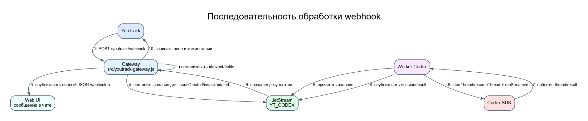
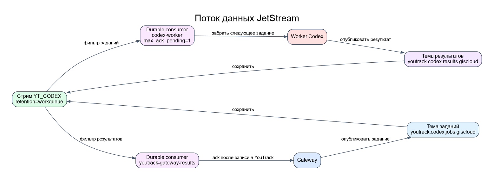

# synadia-nats-agents

Учебный, но production-развернутый pipeline для связи YouTrack, NATS
JetStream и Codex:

```text
YouTrack webhook
  -> POST /youtrack/webhook
  -> gateway-агент YouTrack
  -> job в NATS JetStream
  -> отдельный Codex worker
  -> result event в NATS JetStream
  -> комментарии и поле Codex Session ID в YouTrack
```

Главное правило: HTTP webhook отвечает быстро после постановки job в
JetStream. Codex не запускается внутри webhook handler-а.

<a id="quick-links"></a>
## Быстрые ссылки

- [Что делает проект](#purpose)
- [Как идет один webhook](#runtime-flow)
- [HTTP endpoint-ы](#http-endpoints)
- [Почему нет `/youtrack/agent-messages`](#agent-messages)
- [NATS и JetStream](#nats-jetstream)
- [Локальный запуск](#local-run)
- [Production и deploy](#production)
- [Диаграммы](#diagrams)
- [Проверки перед push](#checks)
- [Подробная карта кода](CODE_MAP.md)
- [Как worker запускает Codex](docs/CODEX_AUTOMATION.md)
- [README Web UI](examples/agent-web-ui/README.md)

<a id="purpose"></a>
## Что Делает Проект

В Web UI виден один Synadia agent:

```text
agents.prompt.youtrack.giscloud.codex
```

Он нужен для discovery, ручного чата и отображения webhook-сообщений. Реальная
автоматизация YouTrack идет через отдельные процессы:

- `app` service: Web UI + gateway-агент YouTrack.
- `codex_worker` service: читает jobs из JetStream и запускает Codex SDK.
- `nats` service: NATS с включенным JetStream.

Ключевые файлы:

- [src/youtrack-gateway.js](src/youtrack-gateway.js) - HTTP webhook, YouTrack
  API client, публикация chat message, постановка jobs, обработка results.
- [src/codex-worker.js](src/codex-worker.js) - последовательный Codex worker.
- [src/jetstream.js](src/jetstream.js) - stream, subjects и durable consumers.
- [skills/youtrack-task-analysis/SKILL.md](skills/youtrack-task-analysis/SKILL.md)
  - инструкция, которую worker вставляет в Codex prompt.
- [examples/agent-web-ui](examples/agent-web-ui/) - Vue/Bun UI.
- [stack/nats-synadia-dev.drs](stack/nats-synadia-dev.drs) - Docker Swarm
  deploy: `nats`, `app`, `codex_worker`.

<a id="runtime-flow"></a>
## Как Идет Один Webhook

1. YouTrack отправляет `POST /youtrack/webhook`.
2. Gateway нормализует payload: `issueId`, `event`, `changedFields`,
   `summary`, `description`.
3. Gateway публикует полный JSON webhook-а в NATS subject
   `youtrack.messages.giscloud.codex`. Открытый UI показывает это как bubble в
   чате.
4. Gateway ставит job в JetStream только для `issueCreated` и `issueUpdated`.
5. `commentAdded` и update только поля `Codex Session ID` игнорируются, чтобы
   не получить webhook loop от собственных комментариев gateway.
6. Worker берет job durable consumer-ом `codex-worker`.
7. Если в задаче уже есть `Codex Session ID`, worker делает resume thread. Если
   поля нет, worker начинает новый Codex thread.
8. Worker публикует `session_started`, `analysis_completed` или
   `analysis_failed` в `youtrack.codex.results.giscloud`.
9. Gateway durable consumer-ом `youtrack-gateway-results` получает result event.
10. Gateway пишет `Codex Session ID` и комментарии в YouTrack.

<a id="http-endpoints"></a>
## HTTP Endpoint-ы

Production URL:

```text
https://nats-synadia-dev.gis-master.ru
```

| Endpoint | Метод | Назначение |
| --- | --- | --- |
| `/healthz` | `GET` | Проверяет UI, NATS, gateway и JetStream consumers. |
| `/youtrack/api-check` | `GET` | Проверяет YouTrack token, comments API, поле `Codex Session ID` и JetStream. |
| `/youtrack/webhook` | `POST` | Единственный публичный webhook endpoint для YouTrack. |
| `/youtrack/webhooks/last` | `GET` | Последние принятые webhook-и в памяти gateway. |
| `/youtrack/jobs/last` | `GET` | Последние jobs/results в памяти gateway. |
| `/youtrack/dry-run-state` | `GET` | In-memory состояние только для `YOUTRACK_DRY_RUN=true`. |

<a id="agent-messages"></a>
## Почему Нет `/youtrack/agent-messages`

`/youtrack/agent-messages` не нужен и не реализован.

В этой версии "agent messages" - это не HTTP endpoint, а NATS subject:

```text
youtrack.messages.giscloud.codex
```

Gateway публикует туда JSON webhook-а, а Bun bridge в Web UI подписывается на
subject и добавляет сообщение в чат. Поэтому live-ответ `404` на
`/youtrack/agent-messages` корректен: такого HTTP route нет в runtime contract.

<a id="nats-jetstream"></a>
## NATS и JetStream

Основные subjects:

```text
agents.prompt.youtrack.giscloud.codex
youtrack.messages.giscloud.codex
youtrack.codex.jobs.giscloud
youtrack.codex.results.giscloud
```

JetStream:

- stream: `YT_CODEX`;
- job subject: `youtrack.codex.jobs.giscloud`;
- result subject: `youtrack.codex.results.giscloud`;
- worker durable consumer: `codex-worker`;
- gateway result durable consumer: `youtrack-gateway-results`.

Основная шина для всех процессов задается через `NATS_URL`:

```bash
NATS_URL=nats://127.0.0.1:4222
```

`NATS_URLS_JSON` нужен только Web UI, если надо показывать discovery сразу по
нескольким независимым NATS-шинам:

```bash
NATS_URLS_JSON='{"main":"nats://127.0.0.1:4222","extra":"nats://host:4222"}'
```

<a id="local-run"></a>
## Локальный Запуск

Установить зависимости:

```bash
npm install
cd examples/agent-web-ui
bun install
```

Запустить smoke без реального YouTrack и без реального Codex:

```bash
npm run nats
CODEX_DRY_RUN=true YOUTRACK_DRY_RUN=true npm run gateway
CODEX_DRY_RUN=true npm run worker
npm run ui:bridge
npm run ui:vite
```

UI будет доступен на `http://localhost:5173`.

Webhook smoke:

```bash
curl -sS http://127.0.0.1:3401/youtrack/webhook \
  -H 'content-type: application/json' \
  -d '{"id":"CS-TEST","event":"issueCreated","summary":"Test issue","description":"Check Codex pipeline","changedFields":["summary"]}' | jq
```

Проверить in-memory состояние:

```bash
curl -sS http://127.0.0.1:3401/youtrack/dry-run-state | jq
curl -sS http://127.0.0.1:3401/youtrack/jobs/last | jq
```

<a id="youtrack"></a>
## YouTrack

Production gateway требует permanent token:

```bash
YOUTRACK_TOKEN=<token>
YOUTRACK_BASE_URL=https://yt.giscloud.ru
YOUTRACK_CODEX_SESSION_FIELD='Codex Session ID'
```

`/youtrack/api-check` проверяет:

- bearer token;
- чтение задач;
- comments API;
- наличие custom field `Codex Session ID`;
- тип поля `TextIssueCustomField`;
- готовность JetStream stream/consumers.

<a id="codex-worker"></a>
## Codex Worker

Worker не получает `YOUTRACK_TOKEN` и не вызывает YouTrack API. Он знает только
NATS, Codex SDK и skill file.

Минимальные env:

```bash
OPENAI_API_KEY=<api-key>
CODEX_PATH_OVERRIDE=/app/scripts/acodex
CODEX_WORKER_CONCURRENCY=1
CODEX_SANDBOX_MODE=read-only
CODEX_APPROVAL_POLICY=never
CODEX_NETWORK_ACCESS=false
CODEX_WEB_SEARCH=disabled
```

`/app/scripts/acodex` - repo-local wrapper вокруг `codex`. Он нужен, чтобы
Codex CLI внутри SDK запускался с proxy/CA окружением. Для production proxy и
MITM CA передаются через env, а не хранятся в git:

```bash
CODEX_PROXY_URL=<proxy-url>
CODEX_MITM_CA_B64=<base64-encoded-ca-pem>
```

Локально можно указать пользовательский wrapper:

```bash
CODEX_PATH_OVERRIDE=/home/komaroff/.local/bin/acodex npm run worker
```

Для локальной проверки без модели:

```bash
CODEX_DRY_RUN=true npm run worker
```

<a id="production"></a>
## Production и Deploy

Один Docker image используется двумя app-процессами:

- `app` - Bun UI + YouTrack gateway. Получает `YOUTRACK_TOKEN`.
- `codex_worker` - только `node src/codex-worker.js`. Получает OpenAI/Codex env,
  но не получает `YOUTRACK_TOKEN`.

Deploy идет через GitLab pipeline:

```text
push в main
  -> build push
  -> deploy
  -> dry-stack deploy в Docker Swarm на gis-master.ru
```

После deploy проверить:

```bash
curl -sS https://nats-synadia-dev.gis-master.ru/healthz | jq
curl -sS https://nats-synadia-dev.gis-master.ru/youtrack/api-check | jq
```

<a id="diagrams"></a>
## Диаграммы

### Общая Архитектура


На схеме видно разделение ответственности: YouTrack приходит в `app`, gateway
публикует chat JSON и JetStream job, worker отдельно запускает Codex и
возвращает result event.

### Последовательность Webhook



Эта диаграмма показывает один полный цикл: от входящего webhook-а до записи
поля и комментариев обратно в YouTrack.

### Поток Данных JetStream



Здесь показано, какие subjects попадают в stream `YT_CODEX`, кто читает jobs и
кто читает results. В MVP worker читает последовательно.

### Деплой


Схема деплоя показывает один Docker image и три service-а в Docker Swarm:
`nats`, `app`, `codex_worker`.

<a id="checks"></a>
## Проверки Перед Push

```bash
node --check src/*.js scripts/*.js
cd examples/agent-web-ui && bun run typecheck && bun run build
git diff --check
```
