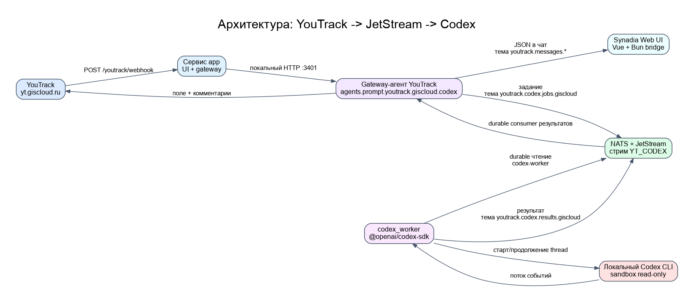
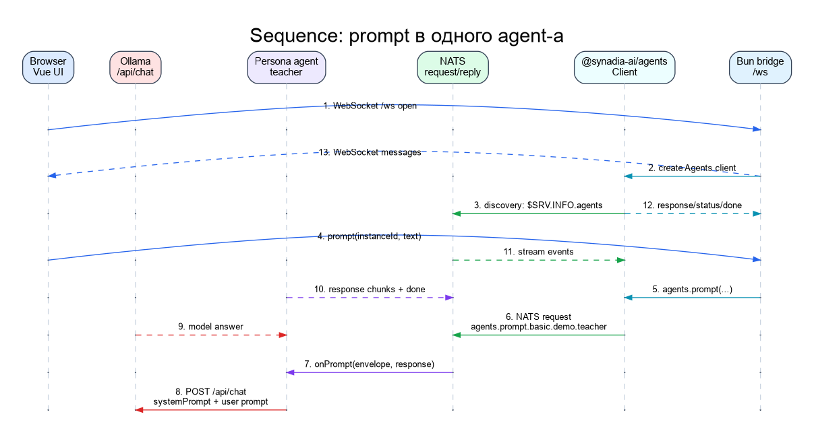
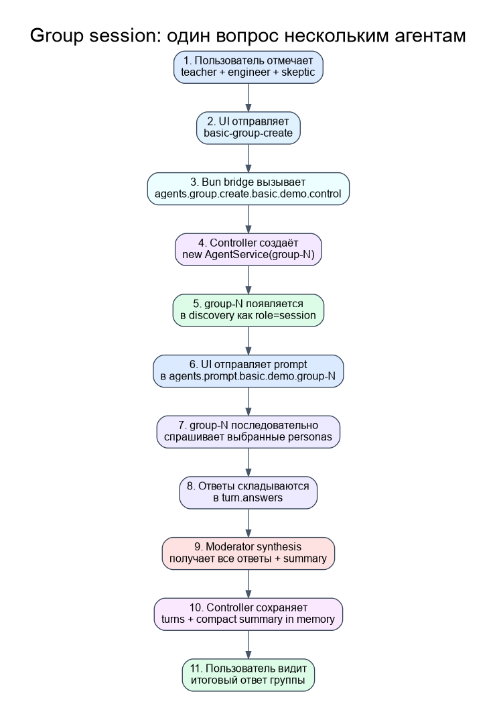
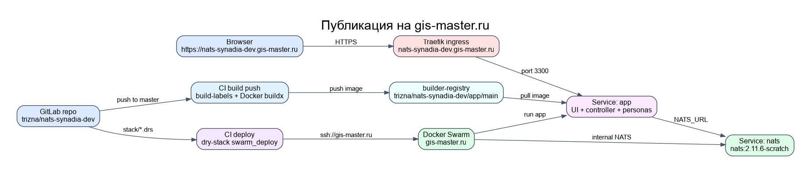

# synadia-nats-agents

Минимальный учебный проект вокруг Synadia Agent Protocol for NATS.

```text
Synadia Vue UI
  -> WebSocket /ws
  -> Bun bridge из examples/agent-web-ui
  -> @synadia-ai/agents
  -> NATS
  -> controller + persona agents
  -> Ollama
  -> streaming responses
```

## Документация и схемы

- [CODE_MAP.md](CODE_MAP.md) - подробная карта кода: где искать runtime, UI, OpenClaw и deploy.
- [docs/diagrams/architecture.png](docs/diagrams/architecture.png) - связь UI, Bun bridge, NATS, controller, persona agents, group sessions и OpenClaw.
- [docs/diagrams/chat-prompt-sequence.png](docs/diagrams/chat-prompt-sequence.png) - последовательность обычного prompt-а в одного agent-а.
- [docs/diagrams/group-session-sequence.png](docs/diagrams/group-session-sequence.png) - последовательность вызовов при групповом вопросе.
- [docs/diagrams/deployment.png](docs/diagrams/deployment.png) - публикация через GitLab CI, Docker registry и dry-stack на `gis-master.ru`.
- [docs/NATS_CONNECTIONS.md](docs/NATS_CONNECTIONS.md) - какие NATS endpoints найдены локально, на `gis-master` и около H100.
- [docs/DEPLOY_SCENARIOS.md](docs/DEPLOY_SCENARIOS.md) - что можно деплоить поверх текущего UI/NATS bridge и зачем это нужно.
- [docs/publishing/2026-05-22-publication-log.md](docs/publishing/2026-05-22-publication-log.md) - журнал публикации и ошибок без секретов.

### Общая архитектура

Описание: схема отвечает на вопрос "какие крупные части вообще есть в
проекте". На ней видны browser UI, Bun bridge, Synadia SDK, NATS, controller,
persona agents, group sessions, OpenClaw и Ollama.

Как читать: слева направо показан путь данных. Браузер не подключается к NATS
напрямую: он говорит только с Bun bridge по `/ws`, а bridge уже использует SDK и
NATS subjects.

Где смотреть код: `examples/agent-web-ui/server/bridge.ts`,
`src/basic-controller.js`, `src/common.js`, `plugins/basic-tools/index.js`.



### Sequence: prompt в одного agent-а

Описание: это UML-like диаграмма последовательности для самого простого
сценария: пользователь пишет сообщение в чат `teacher`, UI отправляет prompt,
agent вызывает Ollama и возвращает streaming chunks обратно в браузер.

Как читать: сверху перечислены участники, вниз идёт время. Сплошные стрелки -
запросы вперёд, пунктирные стрелки - ответы и streaming events назад.

Где смотреть код: `examples/agent-web-ui/src/composables/promptStreaming.ts`,
`examples/agent-web-ui/server/bridge.ts`, `src/basic-controller.js`,
`src/common.js`.



### Group session через controller

Описание: схема показывает групповой сценарий после выбора нескольких agents
галочками. Controller создаёт динамический `group-N` agent, UI отправляет prompt
уже в него, group session собирает ответы выбранных persona agents и делает
итоговый synthesis.

Как читать: сверху вниз показаны шаги одного группового вопроса. Главное отличие
от обычного prompt-а: общий context хранится не в браузере, а в памяти controller
process внутри `groupSessions`.

Где смотреть код: `examples/agent-web-ui/src/components/MultiSelectBar.vue`,
`examples/agent-web-ui/server/bridge.ts`, `src/basic-controller.js`
(`createGroupSession()`, `streamGroupAnswer()`, `groupSessions`).



### Публикация на gis-master.ru

Описание: схема показывает production path публикации проекта. После push в
GitLab runner собирает Docker image, отправляет его в registry, а deploy job
через `dry-stack swarm_deploy` обновляет stack на `gis-master.ru`.

Как читать: слева направо показан путь артефакта: GitLab repo -> CI build ->
registry -> dry-stack deploy -> Swarm services -> Traefik -> browser.

Где смотреть код: `.gitlab-ci.yml`, `docker/Dockerfile`,
`docker/build-images.sh`, `stack/nats-synadia-dev.drs`, `stack/deploy.sh`.



### Что смотреть в CODE_MAP.md

`CODE_MAP.md` - это быстрый навигатор по проекту, чтобы не искать вручную, где
реализован конкретный кусок поведения.

- `Runtime` - `src/basic-controller.js`, `src/common.js`, `src/personas.js`, общий context групп, создание controller и dynamic group sessions.
- `Web UI` - `examples/agent-web-ui/server/*`, `src/stores/*`, `MultiSelectBar.vue`, `ChatPanel.vue`, WebSocket bridge и frontend state.
- `OpenClaw` - `plugins/basic-tools/*` и scripts подготовки official Synadia NATS channel.
- `Публикация` - `.gitlab-ci.yml`, `docker/*`, `stack/nats-synadia-dev.drs`, `scripts/start-production.js`.

## Что здесь есть

- `src/basic-controller.js` - запускает controller и пять persona agents.
- `src/personas.js` - русские роли: `teacher`, `engineer`, `skeptic`, `manager`, `moderator`.
- `src/youtrack-agent.js` - локальный read-only YouTrack agent `youtrack/monitorsoft/triage`.
- `examples/agent-web-ui/` - перенесенный Synadia `examples/agent-web-ui` с локальными правками.
- `plugins/basic-tools/` - OpenClaw command `/basic` и tool `basic_ask`.
- `scripts/prepare-openclaw-nats-channel.js` - подключает официальный `@synadia-ai/nats-channel`.
- `src/monitor.js` - печатает NATS traffic для обучения.

## Где описан controller

Главное место:

- `src/basic-controller.js`, функция `createControllerAgent()`.

Именно там создаётся `new AgentService({ ... })` для `control`:

```js
name: CONTROL_NAME,
session: CONTROL_NAME,
extraMetadata: {
  role: "controller",
  platform: "synadia-agent-web-ui-demo",
},
extraEndpoints: [
  addJsonEndpoint("list", controlSubject("list"), ...),
  addJsonEndpoint("personas", controlSubject("personas"), ...),
  addJsonEndpoint("review", controlSubject("review"), ...),
],
```

По-простому: controller - это не специальная магия Synadia, а обычный
`AgentService`, которому мы дали имя `control` и metadata `role=controller`.
UI видит это поле и кладёт карточку в отдельную секцию `Контроллеры`.

Связанные места:

- `src/common.js` - задаёт константу `CONTROL_NAME = "control"` и общую subject-схему.
- `src/basic-controller.js` - `controlSubject("list" | "personas" | "review")` создаёт служебные subjects controller-а.
- `examples/agent-web-ui/src/stores/agents.ts` - `bucketOf()` читает `metadata.role` и относит `basic/control` к `BASIC_CONTROL`.
- `examples/agent-web-ui/src/components/AgentCard.vue` - controller-карточка получает badge `CONTROLLER` и не получает checkbox для group prompt.
- `plugins/basic-tools/index.js` - OpenClaw `/basic` ищет именно `agent=basic`, `owner=demo`, `name=control`.

Полезная команда, чтобы увидеть controller вживую:

```sh
nats req agents.list.basic.demo.control '{}'
```

## Установка

```sh
cd /home/komaroff/dev/monitorsoft/synadia-nats-agents
npm install
cd examples/agent-web-ui
bun install
```

Настройки смотри в `.env.example`. По умолчанию проект ждёт:

```text
NATS_URL=nats://127.0.0.1:4222
# Можно использовать alias-ы для внешнего NATS:
# NATS_SERVERS=nats://host:4222
# NATS_SERVICE_URL=nats://host:4222
# Несколько независимых NATS-шин для UI:
# NATS_CONNECTIONS_JSON={"demo":"nats://127.0.0.1:4222","weather":"nats://host:4222"}
# NATS_CONNECTIONS=demo=nats://127.0.0.1:4222;weather=nats://host:4222
# Для deploy: подключить app container к существующей docker network.
# Например, чтобы увидеть внутренний NATS другого stack-а на gis-master:
# NATS_EXTERNAL_NETWORK=rag-stack_default
START_BASIC_AGENTS=true
BASIC_OWNER=demo
OLLAMA_BASE_URL=http://ollama.h100.local
OLLAMA_MODEL=qwen3.5:9b
```

## Запуск

В отдельных терминалах:

```sh
npm run nats
npm run controller
npm run monitor
```

Локальный read-only YouTrack agent:

```sh
YOUTRACK_TOKEN=<permanent-token> npm run youtrack
```

Он регистрирует subject:

```text
agents.prompt.youtrack.monitorsoft.triage
```

Минимальный `yt.giscloud.ru` webhook/API-check agent:

```sh
YOUTRACK_BASE_URL=https://yt.giscloud.ru \
YOUTRACK_OWNER=giscloud \
YOUTRACK_AGENT_NAME=codex \
YOUTRACK_TOKEN=<permanent-token> \
npm run youtrack:codex
```

Он поднимает HTTP endpoints:

```text
GET  /healthz
GET  /youtrack/api-check
POST /youtrack/webhook
GET  /youtrack/webhooks/last
GET  /youtrack/agent-messages
```

И регистрирует subject:

```text
agents.prompt.youtrack.giscloud.codex
```

Webhook callback устроен так:

```text
YouTrack Webhook Triggers App
  -> POST https://nats-synadia-dev.gis-master.ru/youtrack/webhook
  -> Bun UI proxy внутри app container
  -> http://127.0.0.1:3401/youtrack/webhook
  -> NATS request youtrack.hooks.giscloud.codex
  -> agent пишет сообщение в свой in-memory журнал
  -> prompt "hooks" или GET /youtrack/agent-messages показывает эти сообщения
```

`/youtrack/webhook` возвращает `200` только после NATS callback ack от агента.
Если callback subject не слушается или NATS недоступен, endpoint вернёт ошибку,
чтобы это было видно в логах/ретраях YouTrack.

Production URL для YouTrack:

```text
https://nats-synadia-dev.gis-master.ru/youtrack/webhook
```

Проверки после deploy:

```sh
curl --noproxy '*' https://nats-synadia-dev.gis-master.ru/youtrack/api-check
curl --noproxy '*' https://nats-synadia-dev.gis-master.ru/youtrack/agent-messages
```

Локальный smoke webhook:

```sh
curl --noproxy '*' -X POST http://127.0.0.1:3401/youtrack/webhook \
  -H 'content-type: application/json' \
  --data '{"eventType":"issueUpdated","issue":{"idReadable":"TEST-1","summary":"Smoke"},"changedFields":[{"name":"State"}]}'
```

Проверить, что hook записался именно как сообщение агента:

```sh
curl --noproxy '*' http://127.0.0.1:3401/youtrack/agent-messages
nats req agents.prompt.youtrack.giscloud.codex '{"prompt":"hooks"}' \
  --wait-for-empty --reply-timeout=5s --timeout=15s --raw
```

UI в dev-режиме:

```sh
npm run ui:bridge
npm run ui:vite
```

Открыть:

```text
http://localhost:5173
```

Если нужно проверить UI на конкретном NATS, можно передать его прямо в
адресной строке. Этот параметр имеет приоритет над `--nats-url`,
`NATS_CONNECTIONS_JSON`, `NATS_CONNECTIONS`, `NATS_URL` и локальным default:

```text
http://localhost:5173/?nats=nats%3A%2F%2F127.0.0.1%3A4222
```

Несколько servers одной NATS-шины передаются через запятую:

```text
http://localhost:5173/?nats=nats%3A%2F%2F127.0.0.1%3A4222,nats%3A%2F%2F127.0.0.1%3A4223
```

Production-like режим:

```sh
npm run ui:build
npm run ui
```

Открыть:

```text
http://localhost:3300
```

Healthcheck production server-а:

```sh
curl --noproxy '*' http://localhost:3300/healthz
```

Подключить UI/agents к стороннему NATS:

```sh
NATS_URL=nats://host:4222 npm run controller
cd examples/agent-web-ui
bun run server/index.ts --nats-url nats://host:4222 --dev
```

То же самое через env alias-ы:

```sh
NATS_SERVERS=nats://host:4222 npm run ui:bridge
NATS_SERVICE_URL=nats://host:4222 npm run controller
```

Приоритет настроек для обычных backend agents: `NATS_URL` -> `NATS_SERVERS`
-> `NATS_SERVICE_URL` -> локальный default `nats://127.0.0.1:4222`.
Для browser UI bridge самый высокий приоритет у адресной строки:
`?nats=nats://host:4222`. В production
`stack/nats-synadia-dev.drs` читает эти же env, поэтому GitLab/Swarm можно
переключить на внешний NATS без изменения кода.

Для production deploy к внутреннему NATS другого stack-а нужно два параметра:

```text
NATS_EXTERNAL_NETWORK=rag-stack_default
NATS_URL=nats://<user>:<password>@rag-stack_inference_nats:4222
START_BASIC_AGENTS=false
```

`NATS_EXTERNAL_NETWORK` даёт контейнеру сетевой доступ/DNS, а `NATS_URL`
говорит SDK, куда подключаться. Пароль не хранится в коде: его передаём через
GitLab pipeline variables.

`START_BASIC_AGENTS=false` выключает наши учебные `basic.demo.*` agents и
оставляет только UI bridge. Это удобно, когда нужно аккуратно посмотреть чужую
NATS-шину, например `agents.prompt.weather.dev.h100`, без регистрации
дополнительных demo services.

## Несколько NATS подключений

UI умеет подключаться сразу к нескольким независимым NATS-шинам:

```text
NATS_CONNECTIONS_JSON={"demo":"nats://nats-synadia-dev_nats:4222","weather":"nats://<user>:<password>@rag-stack_inference_nats:4222","mytest":"nats://host:4222"}
```

Это основной формат для production/deploy. Он передаётся одной JSON-строкой,
поэтому не зависит от shell-разделителя `;` и лучше подходит для URL с
percent-encoded credentials.

Для локальной ручной проверки можно использовать короткий формат:

```text
NATS_CONNECTIONS=demo=nats://nats-synadia-dev_nats:4222;weather=nats://<user>:<password>@rag-stack_inference_nats:4222;mytest=nats://host:4222
```

Как это работает:

- каждая запись `name=url` открывает отдельный NATS client;
- discovery объединяет agents из всех шин в один список;
- карточка agent-а получает badge с именем connection: `demo`, `weather`, `mytest`;
- prompt уходит обратно в ту же NATS-шину, где agent был найден;
- `NATS_URL` остаётся primary bus для встроенных `basic.demo.*` agents/controller;
- приоритет multi-NATS config: `--nats-connections` -> `NATS_CONNECTIONS_JSON` -> `NATS_CONNECTIONS`.

Важно: `NATS_CONNECTIONS` разделяется `;`. Запятая внутри `NATS_URL` остаётся
обычным NATS server-list/failover внутри одной шины, а не несколькими шинами.
В deploy лучше использовать `NATS_CONNECTIONS_JSON`, чтобы `;` не был случайно
интерпретирован оболочкой или инструментом публикации.

Для текущей production demo можно включить и наши учебные agents, и weather:

```text
NATS_URL=nats://nats-synadia-dev_nats:4222
NATS_EXTERNAL_NETWORK=rag-stack_default
NATS_CONNECTIONS_JSON={"demo":"nats://nats-synadia-dev_nats:4222","weather":"nats://<user>:<password>@rag-stack_inference_nats:4222"}
START_BASIC_AGENTS=true
```

## Weather Adapter

Если UI видит `agents.prompt.weather.dev.h100`, правый чат включает adapter
координат. Он нужен потому, что weather agent требует numeric `lat` и `lon`, а
город вроде "Йошкар-Ола" сам пока не геокодирует.

В интерфейсе:

```text
1. Открой карточку WEATHER / h100 / @dev.
2. Выбери пример "Йошкар-Ола" или введи lat/lon руками.
3. Напиши обычный вопрос: "как погода в йошкар оле".
4. UI отправит prompt + extra.lat + extra.lon в NATS envelope.
```

Готовые примеры:

```text
Йошкар-Ола: lat=56.6328 lon=47.8951
Как погода в Йошкар-Оле сейчас? Кратко: температура, осадки, облачность.

Омск: lat=54.9885 lon=73.3242
Проверь текущую погоду и риск осадков рядом с точкой.

Сводка: lat=56.6328 lon=47.8951
Дай короткую погодную сводку: температура, влажность, давление, осадки.
```

## Как работает UI

Браузер не подключается к NATS напрямую.

```text
Browser -> /ws -> Bun bridge -> @synadia-ai/agents -> NATS
```

Bun bridge держит один NATS client, делает discovery через `$SRV.INFO.agents`,
слушает heartbeats и стримит ответы обратно в браузер по WebSocket.

После запуска controller UI должен показать:

- `teacher` - Учитель.
- `engineer` - Инженер.
- `skeptic` - Скептик.
- `manager` - Менеджер.
- `moderator` - Модератор, сравнивает ответы других agents.
- `control` - controller, отдельная секция `Контроллеры`.

Один вопрос одному агенту:

```text
Открой карточку teacher -> напиши prompt -> ответит только Учитель.
```

Один вопрос нескольким агентам:

```text
1. Отметь галочками teacher, engineer, skeptic.
2. В нижней панели включи "Controller group session".
3. Напиши prompt и отправь.
4. UI попросит control создать настоящую group session, например group-1.
5. UI откроет карточку group-1 и отправит туда первый prompt.
```

Важно: для `basic` persona agents группа создаётся controller-ом как настоящий
NATS agent. Именно эта session хранит общий контекст прошлых групповых сообщений
в памяти controller process.

Удалить созданную `BASIC GROUP` можно прямо из интерфейса: нажми `×` на карточке
группы. UI найдёт `BASIC CONTROL`, возьмёт технический
`group.metadata.group_id` (`group-1`, `group-2`, ...), вызовет
`basicGroupStop(control.instanceId, groupId)`, controller остановит динамический
NATS agent, а браузер уберёт карточку и очистит локальную историю чата этой
group session.

Оценить ответы всех agents:

```text
1. Дождись ответа в controller group session.
2. В поле "Как moderator должен оценивать ответы?" напиши критерий:
   "оцени по полноте и практической пользе".
3. Нажми "Оценить ответы".
4. UI соберёт исходный вопрос + ответы всех выбранных agents и отправит их
   отдельному agent-у moderator.
```

Это демонстрирует, как agent получает доступ к ответам других agents:
не через скрытую shared memory, а через явный transcript, переданный в prompt.

## Subjects

Controller:

```text
agents.prompt.basic.demo.control
agents.status.basic.demo.control
agents.hb.basic.demo.control
agents.list.basic.demo.control
agents.personas.basic.demo.control
agents.review.basic.demo.control
agents.group.create.basic.demo.control
agents.group.list.basic.demo.control
agents.group.stop.basic.demo.control
```

Persona agents:

```text
agents.prompt.basic.demo.teacher
agents.prompt.basic.demo.engineer
agents.prompt.basic.demo.skeptic
agents.prompt.basic.demo.manager
agents.prompt.basic.demo.moderator
```

Controller-managed group sessions:

```text
agents.prompt.basic.demo.group-1
agents.status.basic.demo.group-1
agents.hb.basic.demo.group-1
```

Такие sessions создаются динамически через controller. Это настоящие NATS
agents: их видно через discovery, у них есть собственный prompt subject, а общий
контекст группы хранится в controller process.

OpenClaw official channel:

```text
agents.prompt.oc.demo.openclaw
agents.status.oc.demo.openclaw
agents.hb.oc.demo.openclaw
```

## Проверка через NATS CLI

Discovery:

```sh
nats req '$SRV.INFO.agents' '' --replies=0 --timeout=2s
```

Prompt persona напрямую:

```sh
nats req agents.prompt.basic.demo.teacher \
  '{"prompt":"объясни роль controller как ребенку"}' \
  --wait-for-empty --reply-timeout=180s --timeout=300s --raw
```

Prompt controller:

```sh
nats req agents.prompt.basic.demo.control \
  '{"prompt":"объясни путь запроса за 3 пункта"}' \
  --wait-for-empty --reply-timeout=180s --timeout=300s --raw
```

List demo agents:

```sh
nats req agents.list.basic.demo.control '{}'
```

List personas:

```sh
nats req agents.personas.basic.demo.control '{}'
```

YouTrack read-only agent:

```sh
nats req agents.prompt.youtrack.monitorsoft.triage \
  '{"prompt":"ABC-123"}' \
  --wait-for-empty --reply-timeout=30s --timeout=60s --raw
```

Поиск задач:

```sh
nats req agents.prompt.youtrack.monitorsoft.triage \
  '{"prompt":"project: ABC unresolved"}' \
  --wait-for-empty --reply-timeout=30s --timeout=60s --raw
```

YouTrack Codex agent health:

```sh
nats req agents.prompt.youtrack.giscloud.codex \
  '{"prompt":"health"}' \
  --wait-for-empty --reply-timeout=5s --timeout=15s --raw
```

Последние hook-сообщения, которые дошли до agent callback inbox:

```sh
nats req agents.prompt.youtrack.giscloud.codex \
  '{"prompt":"hooks"}' \
  --wait-for-empty --reply-timeout=5s --timeout=15s --raw
```

Review через controller endpoint:

```sh
nats req agents.review.basic.demo.control '{
  "original_prompt": "зачем нужен controller?",
  "criteria": "оцени по простоте, точности и практической пользе",
  "answers": [
    {"agent":"teacher","text":"Controller похож на диспетчера..."},
    {"agent":"engineer","text":"Controller даёт стабильную точку входа..."},
    {"agent":"skeptic","text":"Риск в том, что controller станет бутылочным горлом..."}
  ]
}' --timeout=600s
```

Создать динамическую group session через controller:

```sh
nats req agents.group.create.basic.demo.control '{
  "personas": ["teacher", "engineer", "skeptic"],
  "label": "Учебная группа"
}'
```

После ответа появится новый subject вроде:

```text
agents.prompt.basic.demo.group-1
```

Теперь можно писать уже в саму group session:

```sh
nats req agents.prompt.basic.demo.group-1 \
  '{"prompt":"как controller собирает общий контекст?"}' \
  --wait-for-empty --reply-timeout=180s --timeout=600s --raw
```

Посмотреть группы:

```sh
nats req agents.group.list.basic.demo.control '{}'
```

Остановить группу:

```sh
nats req agents.group.stop.basic.demo.control '{"session_id":"group-1"}'
```

## OpenClaw

Подключить официальный NATS channel и локальный `/basic` plugin:

```sh
npm run openclaw:restart
```

Проверить OpenClaw agent через NATS:

```sh
nats req agents.prompt.oc.demo.openclaw \
  '{"prompt":"/basic объясни путь OpenClaw -> NATS -> controller"}' \
  --wait-for-empty --reply-timeout=180s --timeout=300s --raw
```

## Проверки разработки

```sh
node --check src/*.js scripts/*.js plugins/basic-tools/index.js
cd examples/agent-web-ui && bun run typecheck && bun run build
```

Если Ollama недоступна:

```sh
curl --noproxy '*' http://ollama.h100.local/api/tags
```

## Публикация на gis-master.ru

Remote для публикации:

```sh
git remote set-url origin https://git.giscloud.ru/trizna/nats-synadia-dev.git
```

Pipeline сборки:

```text
push to GitLab
  -> .gitlab-ci.yml
  -> docker/Dockerfile.build
  -> build-labels + docker buildx
  -> builder-registry.builder.giscloud.ru/trizna/nats-synadia-dev/app/main
  -> stack/Dockerfile.deploy
  -> dry-stack swarm_deploy
  -> https://nats-synadia-dev.gis-master.ru
```

Deployment stack:

- `stack/nats-synadia-dev.drs` - dry-stack описание.
- `Service :nats` - внутренняя NATS шина demo.
- `Service :app` - UI + controller + persona agents.
- `ingress host: 'nats-synadia-dev.*'` - ожидаемый публичный адрес `https://nats-synadia-dev.gis-master.ru`.

После deploy быстрые проверки:

```sh
curl --noproxy '*' https://nats-synadia-dev.gis-master.ru/healthz
curl --noproxy '*' -I https://nats-synadia-dev.gis-master.ru/
```
