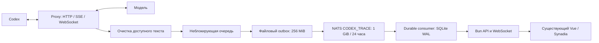

# Живое наблюдение за Codex

Источник — существующий Codex proxy. Desktop, App Server и локальные файлы сессий не подключаются. Наблюдаемые сессии не имеют команд запуска, остановки, approvals или смены модели. Прежний YouTrack-контур открыт владельцу отдельно в `/console/youtrack`.

## Источник и границы данных

`docker/monitor/base.json` фиксирует исходный рабочий proxy с исправлениями ограничения памяти. `proxy.rb` меняет только точки наблюдения; байты основного relay не переписываются. `observer.rb` работает без сетевых вызовов в потоке relay. Диск записывает отдельный поток. Недоступность мониторинга не должна останавливать запросы Codex.

Доступны переданные в proxy сообщения, открытые reasoning/summary, вызовы и вернувшиеся через следующий запрос результаты инструментов, ошибки и usage. Зашифрованный reasoning и скрытые данные не восстанавливаются. System/developer инструкции не сохраняются. Секреты маскируются до outbox, в том числе при разбиении токена между фрагментами. Полная защита произвольных смысловых секретов регулярными выражениями невозможна: перед публикацией владелец проверяет предварительный просмотр.

Сессия коррелируется только по явному session ID. Без него запрос помечается непривязанным. Иерархия агентов не выводится из текста. Завершение ответа модели не означает завершение задачи; отсутствие новых событий отображается как тишина.

SSE разбирается инкрементально, включая UTF-8, CRLF, gzip/deflate. WebSocket использует существующее декодирование кадров proxy и корреляцию response/item ID. Неизвестное сжатие, слишком большой кадр или элемент отмечаются пропуском. Элемент ограничен 2 MiB, кадр SSE — 4 MiB. Длинный текст выдаётся страницами без дополнительного сокращения; в живом снимке последние 80 сегментов, ранние доступны кнопкой. WebSocket закрывает медленного зрителя при буфере свыше 2 MiB; клиент переподключается и получает актуальный снимок.

## Контракт, доставка и токены

Событие содержит `version`, `eventId`, `producer`, `epoch`, `sequence`, `at`, `tenantId`, `connectionId`, `sessionId`, `correlation`, `requestId`, `attemptId`, `type`, `data`. Типы: `source.status`, `request.started`, `request.updated`, `item.snapshot`, `usage.snapshot`, `delivery.gap`.

После PubAck файл удаляется из outbox. Обработчик подтверждает JetStream только после атомарной записи SQLite. Повторы `eventId` не меняют историю. Повтор физического запроса получает отдельный attempt ID. Usage snapshots заменяются по revision, включая уменьшение; конфликт одинаковой revision отображается отдельно. Cached входит во входные токены, reasoning — в выходные. Отсутствующие usage не считаются нулевым расходом. Старые агрегаты proxy вынесены отдельно и не прибавляются автоматически.

Текст хранится 24 часа, ledger — 90 дней. После удаления текста история помечается неполной. Cursor обозначает последнюю применённую запись. WebSocket восстанавливает актуальный снимок, а инспектор событий предоставляет историю по cursor. Это восстановление состояния, а не повтор проигрывания каждого промежуточного delta.

## Доступ

| Путь | Доступ / назначение |
|---|---|
| `/console/` | HTTP Basic через существующий Codex Gateway htpasswd |
| `/api/v1/monitor/` | Закрытый API, доверенные заголовки задаёт Nginx |
| `/monitor/ws` | Закрытый WebSocket, обязательный same-origin |
| `/` | Список только опубликованных сессий |
| `/live/<token>` | Разрешённая история выбранной сессии |
| `/api/public/sessions` | Публичная проекция без частных идентификаторов |
| `/public/ws` | Публичная трансляция, проверка отзыва на каждом обновлении |

Создание публикации требует владельца, JSON и точного Origin. Ссылка действует 24 часа по умолчанию, максимум 168 часов. В БД хранится hash токена; discoverable share ID появляется только после публикации. Выбор начала распространяется на текст, заголовок и usage. Отзыв закрывает соединения зрителей и запрещает историю. Истёкшие ссылки закрываются при периодической проверке. Токены не пишутся в access log, применяется `no-store` и `no-referrer`. Markdown/JSON выводятся как текст Vue без HTML-интерпретации.

## Code-map

| Функция | Модуль | Хранилище / проверка |
|---|---|---|
| Копия HTTP/SSE/WS | `docker/monitor/proxy.rb`, `observer.rb` | `observer_test.rb` |
| Outbox → NATS | `server/monitor/ingest.ts` | PubAck, health status |
| Настройка stream | `server/monitor/setup.ts` | CODEX_TRACE / console-projector |
| Проекция и дедупликация | `server/monitor/store.ts` | events, sessions, items, attempts, usage; `store.test.ts` |
| Публикация и отзыв | `store.ts`, `service.ts` | shares, audit; API и браузерные проверки |
| HTTP/WS | `server/monitor/service.ts` | cursor, Origin, backpressure |
| Экраны и восстановление | `src/MonitorApp.vue`, `src/main.ts` | десктоп/мобильный браузер |

Пути `server/` и `src/` в таблице относятся к `examples/agent-web-ui/`. Перед изменением пройти путь экран → API → проекция → событие → источник. После изменения обновить контракт, схему и связанные проверки.

## Проверки и эксплуатация

Ruby: `ruby docker/monitor/observer_test.rb`. Bun: `bun test examples/agent-web-ui/server/monitor/store.test.ts`. UI: `bunx vue-tsc --noEmit`, `bun run build` из каталога приложения. CI: `.github/workflows/proxy-monitor.yml`.

Выпуск начинается с `MONITOR_ENABLED=false`; обычная raw-трассировка proxy остаётся выключенной. После проверки health включается один разрешённый `MONITOR_USERS`, затем остальные. NATS, SQLite и outbox не публикуются наружу. Изображения собраны вне VPS, у служб лимиты памяти/CPU и ротация логов. Административные NATS credentials используются только для setup, рабочие publisher/projector — раздельные.

Отключение: `MONITOR_ENABLED=false` и пересоздание только proxy. Откат: предыдущие image/compose/Nginx с проверкой health. БД и outbox не удалять при откате. Отдельный отчёт выпуска фиксирует версии, реальные проверки и измерения; синтетические тестовые данные не являются доказательством работы реального модельного трафика.
